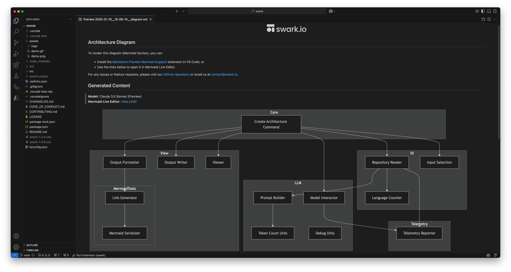

<h1 align="center">
  <a href="https://swark.io">
    <picture>
      <source media="(prefers-color-scheme: dark)" srcset="assets/logo/swark-logo-dark-mode.png">
      <source media="(prefers-color-scheme: light)" srcset="assets/logo/swark-logo-light-mode.png">
      
    </picture>
  </a>
</h1>

<p align="center">
  <b>Automatic Architecture Diagrams from Code</b><br />
  Free • Open Source • Powered by LLMs
</p>

<p align="center">
  <a href="https://marketplace.visualstudio.com/items?itemName=swark.swark">
    </a>
  <a href="https://github.com/swark-io/swark/issues">
    </a>
  <a href="https://github.com/swark-io/swark/blob/main/CONTRIBUTING.md">
    
  </a>
</p>

## Swark

Swark is a VS Code extension that allows creating architecture diagrams from code automatically using large language models (LLMs).\
Swark is **directly integrated with GitHub Copilot**, and requires no authentication or API key.

<h1 align="center">
    
</h1>

### Why Swark?

-   🌟 **Free and Open Source**: All you need is GitHub Copilot, which is now available for free. You can review Swark’s code to understand how it works, and contribute to make it better.
-   🌍 **Universal Language Support**: Classic code visualization solutions are deterministic and require to incrementally add support in new languages or frameworks. With Swark, all the “logic” is encapsulated within the LLM, and therefore it natively support all languages.
-   🔑 **Seamless Integration**: Swark integrates directly with GitHub Copilot. No additional setup, authentication, or API keys required.
-   🛡️ **Privacy First**: Your source code is shared only with GitHub Copilot — no other external APIs or providers involved.
-   🧜‍♀️ **Mermaid.js**: Swark generates diagrams in Mermaid.js, a popular diagram-as-code framework. You can edit and refine the diagrams as needed.

### Use Cases

-   🔎 **Learn a New Codebase**: Instantly generate architecture diagrams to gain a high-level understanding of unfamiliar repositories. Ideal for onboarding and tackling new projects.
-   🤖 **Review AI-Generated Code**: As AI-generated projects become more common, Swark helps you quickly visualize their structure and ensure they meet your standards.
-   📕 **Improve Documentation**: Keep your documentation fresh and detailed with up-to-date architecture diagrams that take minutes to create.
-   🕰️ **Understand Legacy Code**: Quickly visualize and comprehend the structure of legacy codebases, making it easier to maintain and refactor.
-   🧩 **Spot Design Flaws**: Visualize your repo’s dependency graph to identify unwanted dependencies or areas for optimization.
-   ✅ **Test Coverage Insights**: Include test files in Swark’s input to see test coverage at a glance and address gaps.

## How it Works

1. **File Retrieval**: Swark retrieves code files within the chosen folder. Swark automatically adjusts the number of retrieved files to match the LLM max token limit.
2. **Prompt Building**: based on the retrieved files, Swark builds a prompt to generate an architecture diagram. The code files are included in the prompt, together with instructions on how to build the diagram.
3. **LLM Request**: Swark invokes LLM request to GitHub Copilot via VS Code [Language Model API](https://code.visualstudio.com/api/extension-guides/language-model).
4. **Diagram Preview**: upon a successful response, the diagram is presented. This is done by creating a markdown file that includes the diagram in [Mermaid](https://mermaid.js.org/) syntax and previewing it.

### Code Access and File Sharing

It's important to note that source code is **only shared with GitHub Copilot**, and with no other external APIs or providers.

## Requirements

-   **GitHub Copilot**: Swark is integrated with GitHub Copilot to invoke LLM queries. Install it via [Visual Studio Marketplace](https://marketplace.visualstudio.com/items?itemName=GitHub.copilot). Notice that GitHub Copilot now offers a free tier.
-   **Mermaid Markdown Preview**: to preview the diagram in VS Code you can install the [Markdown Preview Mermaid Support](https://marketplace.visualstudio.com/items?itemName=bierner.markdown-mermaid) extension. Otherwise, you can use the provided links to open it in Mermaid Live Editor.

## Installation

Simply install Swark via the [VS Code Extension Marketplace](https://marketplace.visualstudio.com/items?itemName=swark.swark).

## How to Use

1. In VS Code, open the [Command Palette](https://code.visualstudio.com/docs/getstarted/userinterface#_command-palette) and run: **Swark: Create Architecture Diagram**.\
   Alternatively, you can use Swark's default keybindings: `cmd+shift+r` (Mac) or `ctrl+shift+r` (Windows).
2. Select a folder to use in Swark's file search.
3. Within a few seconds, a tab will open displaying your architecture diagram.

<h1 align="center">
    <a href="https://github.com/user-attachments/assets/5b885430-d958-47a0-9daa-f64542844fba"></a>
</h1>

### Output

Swark saves its output in `swark-output` folder under your workspace root folder.\
On each run, Swark creates two output files:

-   **Diagram file**: Contains the diagram's Mermaid code. This file is presented when you run Swark.\
    Filename: `<date>__<time>__diagram.md`
-   **Log file**: Contains information about the run, configuration, and files used to create the diagram. Can be used for debugging and issue reporting.\
    Filename: `<date>__<time>__log.md`

For example:

```bash
workspace-root
└── swark-output
    ├── 2025-01-09__20-18-38__diagram.md
    └── 2025-01-09__20-18-38__log.md
```

## Extension Settings

This extension contributes the following settings:

| Setting                 | Description                                                                                                                              |
| ----------------------- | ---------------------------------------------------------------------------------------------------------------------------------------- |
| `swark.maxFiles`        | Max number of files to read.<br>The number of files read is also affected by the LLM max token limit.                                    |
| `swark.fileExtensions`  | List of file extensions to include in search.                                                                                            |
| `swark.excludePatterns` | List of glob patterns to exclude from file search.<br>Defaults include: `**/.*` for hidden files, `**/node_modules/**` for node modules. |
| `swark.languageModel`   | Language model to use for diagram generation.                                                                                            |

## Release Notes

See [CHANGELOG.md](CHANGELOG.md).

## Contributing

Swark welcomes community contributions.
Please see our [Contribution Guide](CONTRIBUTING.md) for details on how to contribute.

## Privacy Notice

This extension collects telemetry data to help improve the product experience. The data collected includes:

-   Extension activation and usage events
-   Selected model information
-   Number of files processed and prompt length
-   LLM response time
-   Error events

No source code, file contents, or personal information is ever included in the telemetry data.

We use [@vscode/extension-telemetry](https://github.com/microsoft/vscode-extension-telemetry) module to collect this data. The data is sent to Azure Application Insights and is used solely to improve Swark's functionality and user experience.

You can disable telemetry collection by setting `"telemetry.telemetryLevel": "off"` in your VS Code settings.

## License

Swark is licensed under the [GNU Affero General Public License v3.0](https://github.com/swark-io/swark/blob/main/LICENSE)
